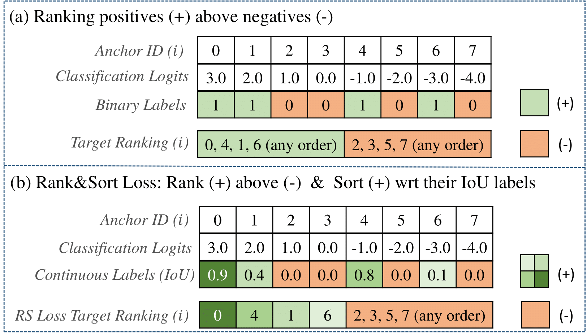
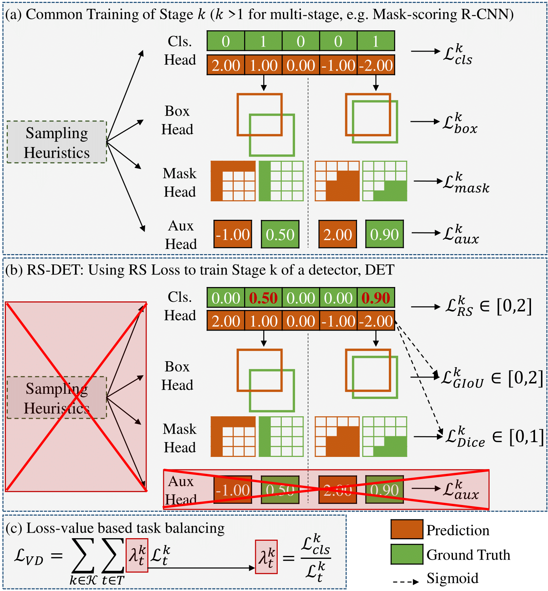

# Rank & Sort Loss for Object Detection and Instance Segmentation 

The official implementation of Rank & Sort Loss. Our implementation is based on [mmdetection](https://github.com/open-mmlab/mmdetection).

> [**Rank & Sort Loss for Object Detection and Instance Segmentation**](https://arxiv.org/abs/2107.11669),            
> [Kemal Oksuz](https://kemaloksuz.github.io/), Baris Can Cam, [Emre Akbas](http://user.ceng.metu.edu.tr/~emre/), [Sinan Kalkan](http://www.kovan.ceng.metu.edu.tr/~sinan/),
> *ICCV 2021 (Oral Presentation). ([arXiv pre-print](https://arxiv.org/abs/2107.11669))*


## Summary

**What is Rank & Sort (RS) Loss?** Rank & Sort (RS) Loss supervises object detectors and instance segmentation methods to (i) rank the scores of the positive anchors above those of negative anchors, and at the same time (ii) sort the scores of the positive anchors with respect to their localisation qualities.

<p align="center">
  
</p>

**Benefits of RS Loss on Simplification of Training.** With RS Loss, we significantly simplify training: (i) Thanks to our sorting objective, the positives are prioritized by the classifier without an additional auxiliary head (e.g. for centerness, IoU, mask-IoU), (ii) due to its ranking-based nature, RS Loss is robust to class imbalance, and thus, no sampling heuristic is required, and (iii) we address the multi-task nature of visual detectors using tuning-free task-balancing coefficients.

<p align="center">
  
</p>

**Benefits of RS Loss on Improving Performance.** Using RS Loss, we train seven diverse visual detectors only by tuning the learning rate, and show that it consistently outperforms baselines: e.g. our RS Loss improves (i)  Faster R-CNN by \~3 box AP and aLRP Loss (ranking-based baseline) by \~2 box AP on COCO dataset, (ii) Mask R-CNN with repeat factor sampling by 3.5 mask AP (\~7 AP for rare classes) on LVIS dataset.

## How to Cite

Please cite the paper if you benefit from our paper or the repository:
```
@inproceedings{RSLoss,
       title = {Rank & Sort Loss for Object Detection and Instance Segmentation},
       author = {Kemal Oksuz and Baris Can Cam and Emre Akbas and Sinan Kalkan},
       booktitle = {International Conference on Computer Vision (ICCV)},
       year = {2021}
}
```

## Specification of Dependencies and Preparation

- Please see [get_started.md](docs/get_started.md) for requirements and installation of mmdetection.
- Please refer to [introduction.md](docs/1_exist_data_model.md) for dataset preparation and basic usage of mmdetection.

## Trained Models
Here, we report minival results in terms of AP and oLRP.

### Multi-stage Object Detection 

#### RS-R-CNN

|    Backbone     |  Epoch |  Carafe  | MS train | box AP | box oLRP  |  Log  | Config | Model |
| :-------------: | :-----: | :-----: | :------------: | :------------: | :------------: | :-------: | :-------: | :-------: |
|    ResNet-50 | 12 |    |    |   39.6  |   67.9  |[log](https://drive.google.com/file/d/1t9mzBh57E-zthckOjwNPkGsP-d6BszDG/view?usp=sharing)| [config](configs/ranksort_loss/ranksort_faster_rcnn_r50_fpn_1x_coco.py) | [model](https://drive.google.com/file/d/1Vr4G47bPSsaxcIbVK_T_JZOyhRCvNXI_/view?usp=sharing) |
|    ResNet-50 | 12 | + |    |   40.8  |   66.9  |[log](https://drive.google.com/file/d/10_r2JQ3XJ1V-IWOx3qcNFKedwLaDb8Qu/view?usp=sharing)| [config](configs/ranksort_loss/ranksort_faster_rcnn+_r50_fpn_1x_coco.py) | [model](https://drive.google.com/file/d/1IRgJMAJL14S5Q5ygpg94pj6y4pflV7DI/view?usp=sharing) |
|    ResNet-101-DCN |  36 |    |   [480,960]  |   47.6 |   61.1  |[log](https://drive.google.com/file/d/16JG0RN9sMCZSKhTtNnKGrdQu_5mMUrcn/view?usp=sharing)| [config](configs/ranksort_loss/ranksort_faster_rcnn_r101_fpn_mstrain_dcn_3x_coco.py) | [model](https://drive.google.com/file/d/1UtY-vVy-1sTZxga109zz-0WeLrX0l9Aq/view?usp=sharing) |
|    ResNet-101-DCN | 36 |  +  |   [480,960]  |  47.7  |   60.9  |[log](https://drive.google.com/file/d/1aYHOVK-BwcN2sHfyW3P46ieHU1wZoX5G/view?usp=sharing)| [config](configs/ranksort_loss/ranksort_faster_rcnn+_r101_fpn_mstrain_dcn_3x_coco.py) | [model](https://drive.google.com/file/d/1tzXxzED6Vir5Lx8tZeduJhCUgQFsW_ak/view?usp=sharing) |

#### RS-Cascade R-CNN
|    Backbone     |  Epoch  | box AP |  box oLRP |  Log  | Config | Model |
| :-------------: | :-----: | :------------: | :------------: | :-------: | :-------: |:-------: |
|    ResNet-50    | 12 |   41.3  | 66.6 | Coming soon |  |  |

### One-stage Object Detection
|    Method     |  Backbone |  Epoch  | box AP | box oLRP  |  Log  | Config | Model |
| :-------------: | :-----: | :-----: | :------------: | :------------: | :-------: | :-------: | :-------: |
| RS-ATSS |    ResNet-50 | 12 |   39.9  |   67.9  |[log](https://drive.google.com/file/d/1Ya2V728qtS5WTl7V-hS052DPETXh8c6b/view?usp=sharing)| [config](configs/ranksort_loss/ranksort_atss_r50_fpn_1x_coco.py) | [model](https://drive.google.com/file/d/1yQ0gVXSIK2SOvwyYjv9vT5DqFcExZ5Ty/view?usp=sharing) |
| RS-PAA |    ResNet-50 | 12 |   41.0  |   67.3  |[log](https://drive.google.com/file/d/1nEYfrgFPX24AXy13UB0vddASeu3tFTG7/view?usp=sharing)| [config](configs/ranksort_loss/ranksort_paa_r50_fpn_1x_coco.py) | [model](https://drive.google.com/file/d/1oGILFHoaFEOkh0ba-9bIHkw3yrzXcQ5I/view?usp=sharing) |

### Multi-stage Instance Segmentation 

#### RS-Mask R-CNN on COCO Dataset

|    Backbone     |  Epoch  |  Carafe | MS train | mask AP | box AP | mask oLRP | box oLRP |  Log  | Config | Model |
| :-------------: | :-----: | :-----: | :------------: | :------------: | :------------: | :------------: | :------------: | :-------: | :-------: |:-------: |
|    ResNet-50 | 12 |   |    |   36.4  | 40.0 |   70.1  | 67.5 |[log](https://drive.google.com/file/d/1TkEreoyNZHQaPO9hHqzAjtNsrpEcFwUA/view?usp=sharing)| [config](configs/ranksort_loss/ranksort_mask_rcnn_r50_fpn_1x_coco.py) | [model](https://drive.google.com/file/d/1fS1Pm3vjvfGvVdrCOMPzK2pgc8D-NZlI/view?usp=sharing) |
|    ResNet-50 | 12 |  + |    |   37.3  | 41.1 |   69.4  | 66.6 |[log](https://drive.google.com/file/d/1xVlrp_rM7x4hjd11hMsMbyTtZdkN0AvZ/view?usp=sharing)| [config](configs/ranksort_loss/ranksort_mask_rcnn+_r50_fpn_1x_coco.py) | [model](https://drive.google.com/file/d/1eILvISf6pZDCcpY9lpaFt-kfD9SuLTtD/view?usp=sharing) |
|    ResNet-101 | 36 |    |   [640,800]  | 40.3  |44.7 |   66.9  | 63.7 |[log](https://drive.google.com/file/d/1Kfa3crXzRe2p_hAd-jZ4YiLLU0hidk8C/view?usp=sharing)| [config](configs/ranksort_loss/ranksort_mask_rcnn_r101_fpn_mstrain_3x_coco.py) | [model](https://drive.google.com/file/d/1Y44V2Ydn8t9G9QXv-pnQk8PpzcC4KzW5/view?usp=sharing) |
|    ResNet-101| 36 |  +  |   [480,960]  |   41.5  | 46.2 |   65.9  | 62.6 |[log](https://drive.google.com/file/d/1YGrrdzdPW5w3r4kSPTaMz6btQjyRXdCX/view?usp=sharing)| [config](configs/ranksort_loss/ranksort_mask_rcnn+_r101_fpn_mstrain_3x_coco.py) | [model](https://drive.google.com/file/d/1fEFutf0C0BOhqrzdDK6XIDDBvNUtSIRs/view?usp=sharing) |
|    ResNet-101-DCN | 36 |  +  |   [480,960]  |   43.6  | 48.8 |   64.0  | 60.2 |[log](https://drive.google.com/file/d/1CgZw3QRFROZZztO_UotwBOn_k0WavsIe/view?usp=sharing)| [config](configs/ranksort_loss/ranksort_mask_rcnn+_r101_dcn_fpn_mstrain_3x_coco.py) | [model](https://drive.google.com/file/d/14cE5xw-xgxsuH3P98o2IhFh0ZBfOgIM_/view?usp=sharing) |
|    ResNeXt-101-DCN | 36 |  +  |   [480,960]  |   44.4  | 49.9 |   63.1  | 59.1 | Coming Soon | [config](configs/ranksort_loss/ranksort_mask_rcnn+_x101_dcn_fpn_mstrain_3x_coco.py) | [model](https://drive.google.com/file/d/12p-nev9sMvlKmogje2Lsz5qdW1mGTYBA/view?usp=sharing) |

#### RS-Mask R-CNN on LVIS Dataset
|    Backbone     |  Epoch  | MS train | mask AP | box AP | mask oLRP | box oLRP |  Log  | Config | Model |
| :-------------: | :-----: | :------------: | :------------: | :------------: | :------------: | :------------: | :-------: | :-------: |:-------: |
|    ResNet-50  | 12 |  [640,800]  |   25.2  | 25.9 |   Coming Soon  | Coming Soon | [log](https://drive.google.com/file/d/1f8uYJaMvVnE5ZbW34gFYi6LG5lx6Zp8G/view?usp=sharing)| [config](configs/ranksort_loss/ranksort_mask_rcnn_r50_fpn_1x_lvis_v1.py) | [model](https://drive.google.com/file/d/1eTe-xaH_m94aMWdAvczdNswGn1vwXELx/view?usp=sharing) |


### One-stage Instance Segmentation

#### RS-YOLACT

|    Backbone     |  Epoch  | mask AP | box AP | mask oLRP | box oLRP |  Log  | Config | Model |
| :-------------: | :-----: | :------------: | :------------: | :------------: | :------------: | :-------: | :-------: |:-------: |
|    ResNet-50    | 55 |   29.9  | 33.8 |   74.7  | 71.8 |[log](https://drive.google.com/file/d/1Cc55XcKMo2gIuSyy2VWqU0aNP96G5N7s/view?usp=sharing)| [config](configs/ranksort_loss/ranksort_yolact_r50_55e_coco.py) | [model](https://drive.google.com/file/d/1JVmHCpo97BqypXdyFs7gvGFNDAOFEp19/view?usp=sharing) |

#### RS-SOLOv2

The implementation of Rank & Sort Loss on Solov2 is released in a seperate repository due to mmdetection version difference. You can check out our RS-Solov2 implementation [in this repository](https://github.com/kemaloksuz/RankSortLoss-Solov2). Any pull request to incorporate RS-Solov2 to this repository is highly appreciated.

| Backbone    |  Epoch  | mask AP | mask oLRP  |
| :---------: | :-----: | :------------: | :------------: | 
|   ResNet-34 | 36 |   32.6  |   72.7  | 
|  ResNet-101 | 36 |   39.7  |   66.9  | 

## Running the Code

### Training Code
The configuration files of all models listed above can be found in the `configs/ranksort_loss` folder. You can follow [get_started.md](docs/get_started.md) for training code. As an example, to train Faster R-CNN with our RS Loss on 4 GPUs as we did, use the following command:

```
./tools/dist_train.sh configs/ranksort_loss/ranksort_faster_rcnn_r50_fpn_1x_coco.py 4
```

### Test Code
The configuration files of all models listed above can be found in the `configs/ranksort_loss` folder. You can follow [get_started.md](docs/getting_started.md) for test code. As an example, first download a trained model using the links provided in the tables below or you train a model, then run the following command to test an object detection model on multiple GPUs:

```
./tools/dist_test.sh configs/ranksort_loss/ranksort_faster_rcnn_r50_fpn_1x_coco.py ${CHECKPOINT_FILE} 4 --eval bbox 
```
and use the following command to test an instance segmentation model on multiple GPUs:

```
./tools/dist_test.sh configs/ranksort_loss/ranksort_mask_rcnn_r50_fpn_1x_coco.py ${CHECKPOINT_FILE} 4 --eval bbox segm 
```
You can also test a model on a single GPU with the following example command:
```
python tools/test.py configs/ranksort_loss/ranksort_faster_rcnn_r50_fpn_1x_coco.py ${CHECKPOINT_FILE} 4 --eval bbox 
```

## Details for Rank & Sort Loss Implementation

Below is the links to the files that can be useful to check out the details of the implementation:
- [Implementation of the Rank & Sort Loss (also AP Loss and aLRP Loss)](mmdet/models/losses/ranking_losses.py)
- [RS-RPN](mmdet/models/dense_heads/rank_based_rpn_head.py)
- [RS-R-CNN](mmdet/models/roi_heads/bbox_heads/convfc_bbox_head.py)
- [Rank-based RoI Head](mmdet/models/roi_heads/rankbased_standard_roi_head.py) 
- [Mask prediction head of RS-Mask R-CNN](mmdet/models/roi_heads/mask_heads/rankbased_fcn_mask_head.py)
- [Config files folder of RS Loss](configs/ranksort_loss)

